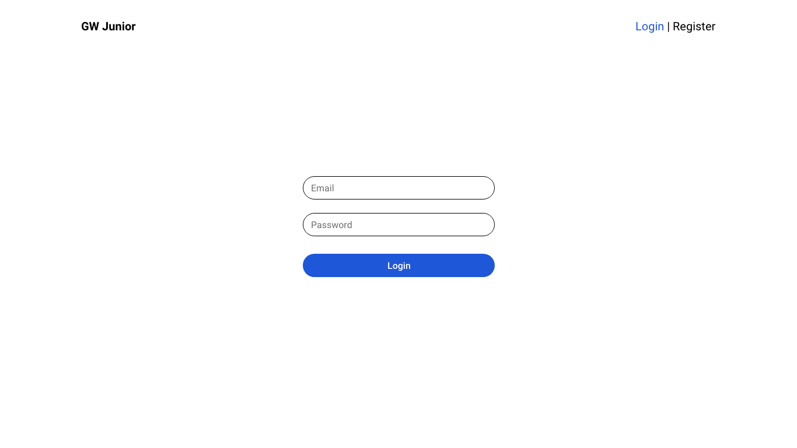
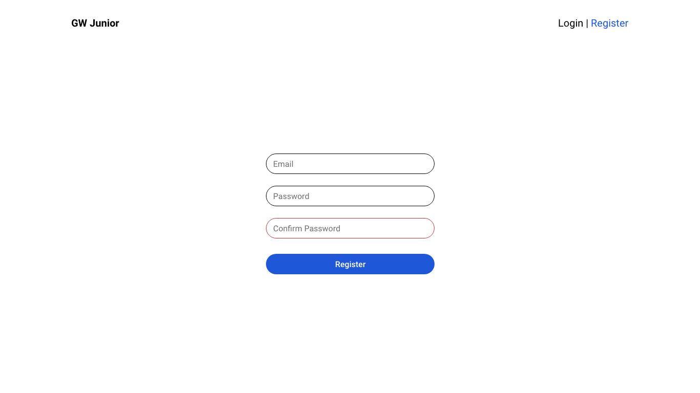
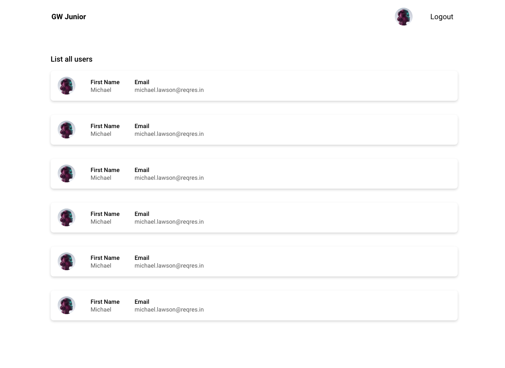
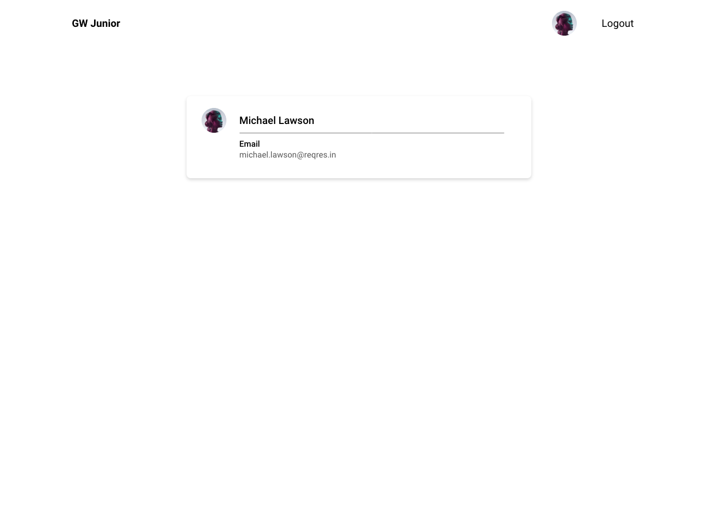

# GW Desafio Front-end Developer Junior

Desafio GW Front-end Junior é para avaliar o nível de compreensão nos quesitos componentização e interação.

## Em que consiste o desafio:

Criar uma aplicação em React onde o usuário poderá fazer Login, Registro e Listar todos os usuários, ao clicar em um usuário da lista
deve mostrar os dados desse usuário.

## Rotas

São 4 rotas sendo 2 pública e 2 privadas

### Login

Rota pública

### Registro

Rota pública

### Listar todos usuários

Rota privada, só é acessível se o usuário estiver logado
Exibir dados do usuário selecionado.

### Mostrar Usuário selecionado na lista

Rota privada, só é acessível se o usuário estiver logado
Exibir dados do usuário selecionado.

## Usa a API free do reqres para fazer as requisições

https://reqres.in/

## Design

Todos os arquivos necessários relacionado a UI estão na pasta [assets](./assets/)

Você pode usar XD para [abrir](./assets/GW-Front-Junior.xd) o arquivo da UI para verificar as medidas utilizando o Adobe XD.

## Regras

- Usar React ou algum framework React
- Pode utilizar bibliotecas como Chakra UI, Material UI...
- Usar Axios ou Fetch para fazer requisições a api ReqRes

## Telas

### Login

### Register

### List users

### User Profile

